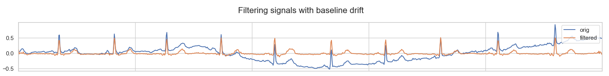

# AI For Health

In this repo I will upload exercises and examples of how AI can be used to improve health diagnosis.

🚧 **Work in Progress** 🚧

## ECG Signal Analysis with AI tools

Welcome to my ECG Signal Analysis Jupyter Notebook! This repo contains a comprehensive analysis of Electrocardiogram (ECG) signals using Convolutional Neural Networks (CNNs) and other AI tools. The notebook is designed to provide some insights into ECG signals by implementing functionalities such as a peak detector and a signal filter.

Check out the Jupyter notebook [here](ecg_analysis.ipynb)